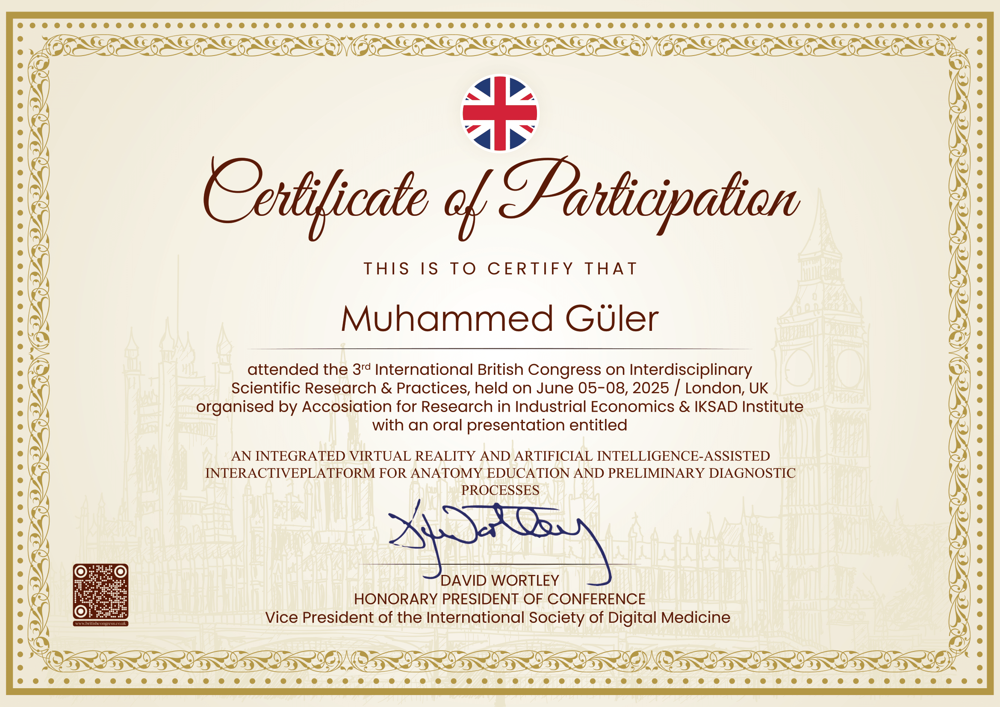
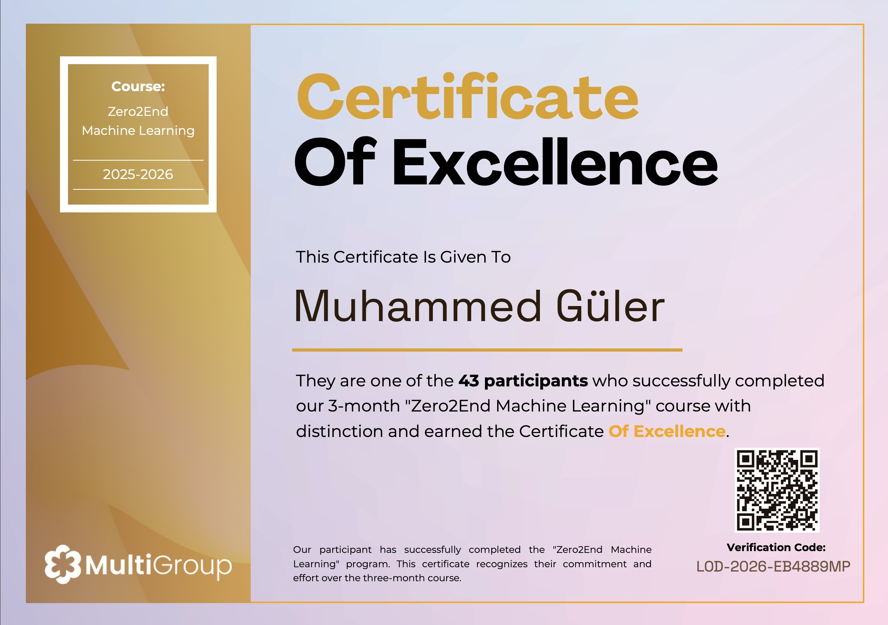
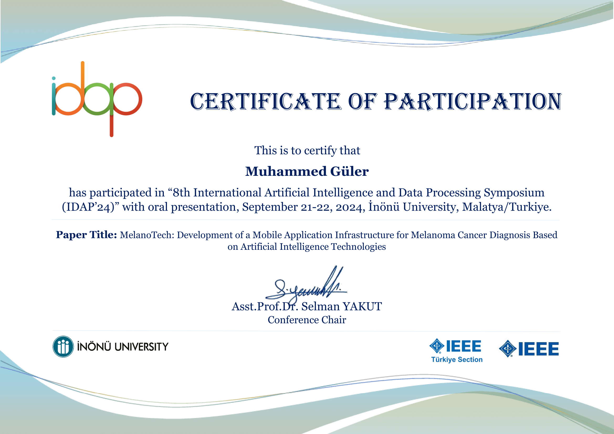
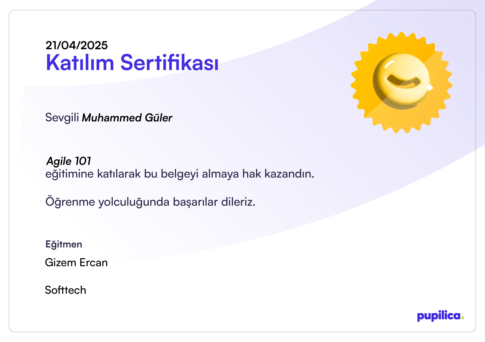
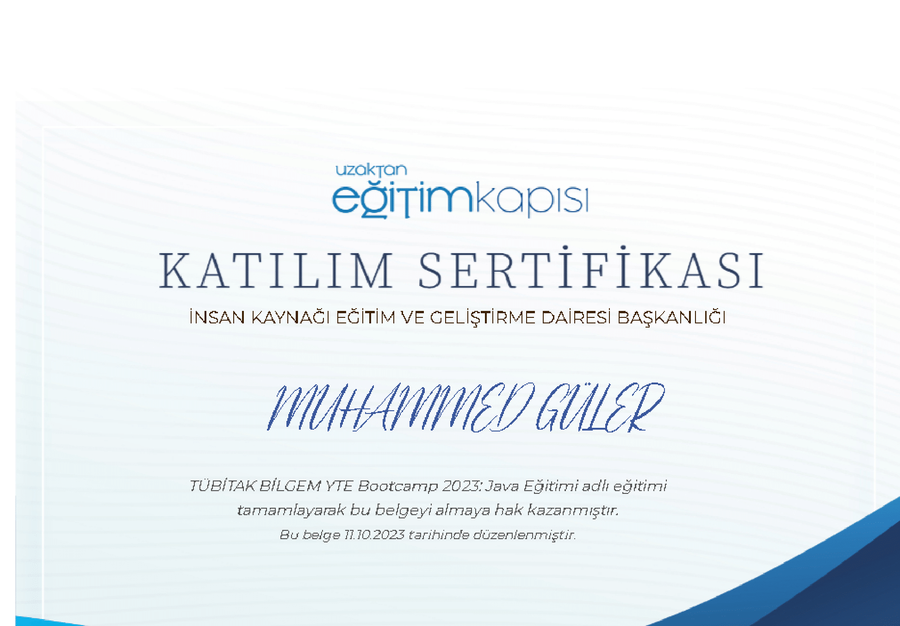
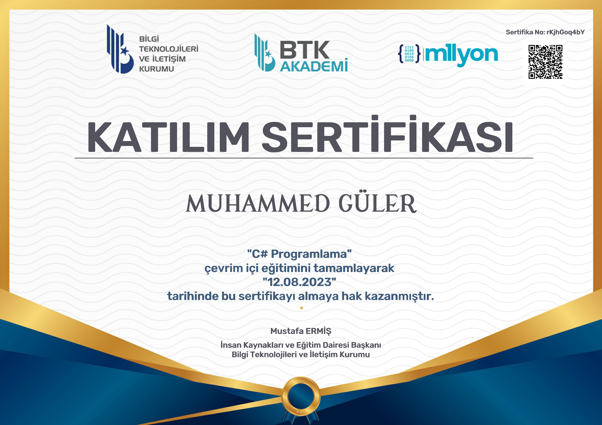

  

  

    
  

  <!-- Social Badges -->
  

    
    
  

---

## 👨‍💻 About Me

**Computer Engineer · AI & Machine Learning · Embedded Systems**  
📍 Istanbul, Turkey 🇹🇷

- 🎓 **Computer Engineering student** at Istanbul Health and Technology University (*Full Scholarship*)
- 🚁 **Former Embedded Software Intern** at **BAYKAR** - Turkish UAV & Defense Technology Manufacturer
- 🤖 **Passionate about** Artificial Intelligence, Deep Learning, and Computer Vision
- 🔬 **Published researcher** in AI-powered medical applications (*IEEE Conference Publication*)
- 🎯 **Specialized in** Turkish NLP, sentiment analysis, and transformer models
- 💡 **Active in robotics and automation projects** as IEEE ISTUN Student Club RAS Committee Chair
- 🏆 **TEKNOFEST Finalist** with CodeSwaper educational platform startup

---

## 🛠️ Tech Stack & Skills

### 💻 Programming Languages

  
  
  
  
  
  

### 🤖 AI, Machine Learning & Data Science

  
  
  
  
  
  
  
  

### ⚡ Embedded Systems & IoT

  
  
  
  

### 🔧 Tools, Frameworks & Cloud

  
  
  
  
  

---

## 📊 GitHub Analytics

  
  
    
  

---

## 🏆 Featured Projects & Research

### 📱 MelanoTech: AI-Powered Melanoma Diagnosis
> **IEEE Published Research (IDAP 2024)**  
> *A mobile health application enabling early skin cancer detection using advanced AI technologies.*
- 🧬 Deep learning with attention mechanisms (CNNs)
- 📈 GAN-based data augmentation (+5% model performance)
- 🎯 Achieved 92% overall accuracy  
🔗 [Read the Paper on IEEE Xplore](https://ieeexplore.ieee.org/document/10453269) | **Authors:** N. Tokatlı, Y. Bilmez, G. Göztepeli, M. Güler, F. Karan, H. Altun

### 🗣️ Turkish Sentiment Analysis with Transformer Models
> *Specialized NLP system addressing the challenges of agglutinative Turkish morphology.*
- Fine-tuned state-of-the-art transformer architectures: **BERT, DistilBERT, and XLM-RoBERTa**
- Evaluated on real-world Turkish e-commerce customer review datasets for sentiment classification

### 🔒 IoT-Enabled Smart Safe with Facial Recognition
> *Biometric IoT security solution built with edge hardware and intelligent verification.*
- Integrated **ESP32-CAM** with computer vision facial recognition algorithms
- Designed an intuitive web interface for real-time alerts and remote device access

---

## 💼 Work Experience

### 🚁 Embedded Software Intern @ BAYKAR Tech
*September 2023 – December 2023 | Istanbul, Türkiye*
- Developed automation solutions in **C# .NET**, delivering a **70% improvement** in data analysis efficiency
- Conducted technical research and delivered presentations across interdisciplinary engineering teams
- Contributed to mission-critical software workflows in the aerospace & defense sector

---

## 🎓 Education

### 🏛️ Istanbul Health and Technology University
**B.Sc. in Computer Engineering** *(Full Scholarship)*  
*2021 – 2025 | Istanbul, Türkiye*  
🌐 [University Website](https://www.istun.edu.tr/)

---

## 🌐 Languages & 🎯 Hobbies

<table width="100%">
<tr>
<td width="50%" valign="top">

### 🗣️ Languages
- 🇹🇷 **Turkish** — Native
- 🌐 **English (EN)** — Upper-Intermediate (B2)
- 🇩🇪 **German** — Basic (A1)

</td>
<td width="50%" valign="top">

### 🏊 Hobbies & Interests
- 📚 Reading Historical & Scientific Literature
- 🏊 Swimming
- 🏋️ Fitness & Athletic Training

</td>
</tr>
</table>

---

## 📜 Certifications & Achievements / Sertifikalar & Başarılar

<h3>🥇 2026 Sertifikaları & Eğitimleri (12 Sertifika)</h3>

 

| Sertifika / Eğitim Programı | Kurum / Sağlayıcı | Belge Bağlantısı |
| :--- | :--- | :---: |
| **Google Advanced Data Analytics Capstone** | Google | [📄 Görüntüle (PDF)](./certificates/2026/Certificate_GOOGLE_Google_Advanced_Data_Analytics_Capstone.pdf) |
| **Analyze Data to Answer Questions** | Google | [📄 Görüntüle (PDF)](./certificates/2026/Certificate_GOOGLE_Analyze_Data_to_Answer_Questions.pdf) |
| **Ask Questions to Make Data-Driven Decisions** | Google | [📄 Görüntüle (PDF)](./certificates/2026/Certificate_GOOGLE_Ask_Questions_to_Make_Data-Driven_Decisions.pdf) |
| **Get Started with Python** | Google | [📄 Görüntüle (PDF)](./certificates/2026/Certificate_GOOGLE_Get_Started_with_Python.pdf) |
| **Go Beyond the Numbers: Translate Data into Insights** | Google | [📄 Görüntüle (PDF)](./certificates/2026/Certificate_GOOGLE_Go_Beyond_the_Numbers_Translate_Data_into_Insights.pdf) |
| **Prepare Data for Exploration** | Google | [📄 Görüntüle (PDF)](./certificates/2026/Certificate_GOOGLE_Prepare_Data_for_Exploration.pdf) |
| **Process Data from Dirty to Clean** | Google | [📄 Görüntüle (PDF)](./certificates/2026/Certificate_GOOGLE_Process_Data_from_Dirty_to_Clean.pdf) |
| **Regression Analysis: Simplify Complex Data Relationships** | Google | [📄 Görüntüle (PDF)](./certificates/2026/Certificate_GOOGLE_Regression_Analysis_Simplify_Complex_Data_Relationships.pdf) |
| **The Nuts and Bolts of Machine Learning** | Google | [📄 Görüntüle (PDF)](./certificates/2026/Certificate_GOOGLE_The_Nuts_and_Bolts_of_Machine_Learning.pdf) |
| **The Power of Statistics** | Google | [📄 Görüntüle (PDF)](./certificates/2026/Certificate_GOOGLE_The_Power_of_Statistics.pdf) |
| **Girişimciler İçin İnsan Kaynakları Eğitimi** | YZTA | [📄 Görüntüle (PDF)](./certificates/2026/Certificate_YZTA_Girisimciler_icin_Insan_Kaynaklari_Egitimi.pdf) |
| **Girişimciler İçin Hukuk Eğitimi** | YZTA | [📄 Görüntüle (PDF)](./certificates/2026/Certificate_YZTA_Girisimciler_in_Hukuk_Eitimi_Sertifikas.pdf) |

 

<h3>🥈 2025 Sertifikaları & Başarıları (13 Sertifika)</h3>

 

| Sertifika / Etkinlik / Program | Kurum / Sağlayıcı | Belge Bağlantısı & Önizleme |
| :--- | :--- | :--- |
| **3rd International British Congress on Interdisciplinary Scientific Research & Practices** | British Congress | [📄 Görüntüle (PDF)](./certificates/2025/3rd_International_British_Congress.pdf) &bull; [🖼️ Görsel (PNG)](./certificates/2025/3rd_International_British_Congress.png)   |
| **Generative AI Giriş Bootcamp & Yeni Nesil Proje Kampı** | Akbank | [📄 Görüntüle (PDF)](./certificates/2025/Sertifika_Akbank-Generative-AI-Giris-Bootcamp_Akbank-Generative-AI-Bootcamp-Yeni-Nesil-Proje-Kampi_themuhammedguler.pdf) |
| **Foundations: Data, Data, Everywhere** | Google / Coursera | [📄 Görüntüle (PDF)](./certificates/2025/Sertifika_Coursera_Google_Data_Data_Everywhere.pdf) |
| **Google Cloud Core Infrastructure** | Google Cloud | [📄 Görüntüle (PDF)](./certificates/2025/Sertifika_Muhammed%20G%C3%BCler_Google_Cloud_Core_Infrastructure.pdf) |
| **Üretken Yapay Zeka (GenAI)** | Garanti BBVA | [📄 Görüntüle (PDF)](./certificates/2025/Sertifika_GarantiBBVA_GENAI.pdf) |
| **ChatGPT Kullanımı ve Prompt Mühendisliği** | Garanti BBVA | [📄 Görüntüle (PDF)](./certificates/2025/Sertifika_GarantiBBVA_ChatGPT_Kullanimi_Promp_Muhendisligi.pdf) |
| **Temel Makine Öğrenmesi** | Garanti BBVA | [📄 Görüntüle (PDF)](./certificates/2025/Sertifika_GarantiBBVA_Temel_Makine_Ogrenmesi.pdf) |
| **LLM ve Gerçek Etki** | Yapay Zeka / LLM Eğitimi | [📄 Görüntüle (PDF)](./certificates/2025/Sertifika_Muhammed_G%C3%BCler_LLM_GERCEK_ETKI.pdf) |
| **Machine Learning** | Zero2End | [🖼️ Görüntüle (JPG)](./certificates/2025/Sertifika_Zero2End_Machine_Learning.jpg)   |
| **Mikroservis Mimarileri** | Taner Saydam | [📄 Görüntüle (PDF)](./certificates/2025/Sertifika_Muhammed_G%C3%BCler_Mikroservis_TanerSaydam.pdf) |
| **Su Altı Sistemleri ve Teknolojileri** | İnsansız Su Altı Sistemleri | [📄 Görüntüle (PDF)](./certificates/2025/Sertifika_Muhammed_G%C3%BCler_SU_ALTI.pdf) |
| **Girişimciler İçin Finans Eğitimi** | Girişimcilik Eğitimi | [📄 Görüntüle (PDF)](./certificates/2025/Girisimciler_icin_Finans_Egitimi_Sertifikasi.pdf) |
| **Temel Girişimcilik Eğitimi** | Girişimcilik Eğitimi | [📄 Görüntüle (PDF)](./certificates/2025/Temel_Giriimcilik_Eitimi_Sertifikas.pdf) |

 

<h3>🥉 2024 Sertifikaları & Başarıları (2 Sertifika)</h3>

 

| Sertifika / Etkinlik / Program | Kurum / Sağlayıcı | Belge Bağlantısı & Önizleme |
| :--- | :--- | :--- |
| **8th International AI & Data Processing Symposium (IDAP'24) - MelanoTech** | IEEE / IDAP | [📄 Görüntüle (PDF)](./certificates/2024/IDAP_MelanoTech_Participation.pdf) &bull; [🖼️ Görsel (PNG)](./certificates/2024/IDAP_MelanoTech_Participation.png)   |
| **Agile 101 Eğitimi** | Softtech | [📄 Görüntüle (PDF)](./certificates/2024/Agile101-Softtech.pdf) &bull; [🖼️ Görsel (PNG)](./certificates/2024/Agile101-Softtech.png)   |

 

<h3>🎖️ 2023 Sertifikaları & Başarıları (4 Sertifika)</h3>

 

| Sertifika / Etkinlik / Program | Kurum / Sağlayıcı | Belge Bağlantısı & Önizleme |
| :--- | :--- | :--- |
| **Java Bootcamp** | TÜBİTAK BİLGEM | [📄 Görüntüle (PDF)](./certificates/2023/TUBITAK_BILGEM_JavaBootCamp.pdf) &bull; [🖼️ Görsel (PNG)](./certificates/2023/TUBITAK_BILGEM_JavaBootCamp.png)   |
| **Mikroservis Mimarileri Eğitimi (YTE Bootcamp 2023)** | TÜBİTAK BİLGEM YTE | [📄 Görüntüle (PDF)](./certificates/2023/T%C3%9CB%C4%B0TAK_B%C4%B0LGEM_YTE_Bootcamp_2023_Mikroservis_Mimarileri_E%C4%9Fitimi.pdf) &bull; [🖼️ Görsel (PNG)](./certificates/2023/T%C3%9CB%C4%B0TAK_B%C4%B0LGEM_YTE_Bootcamp_2023_Mikroservis_Mimarileri_E%C4%9Fitimi.png)   |
| **C# Programlama** | BTK Akademi | [📄 Görüntüle (PDF)](./certificates/2023/CSharp_Programlama_Sertifika_BTK.pdf) &bull; [🖼️ Görsel (PNG)](./certificates/2023/CSharp_Programlama_Sertifika_BTK.png)   |
| **TEKNOFEST Katılım Belgesi** | TEKNOFEST | [📄 Görüntüle (PDF)](./certificates/2023/Teknofest-Kat%C4%B1l%C4%B1m-Belgesi.pdf) &bull; [🖼️ Görsel (PNG)](./certificates/2023/Teknofest-Kat%C4%B1l%C4%B1m-Belgesi.png)   |

---

## 📫 Let's Connect!

  
  

 

  <i>"Engineering intelligent systems at the intersection of Artificial Intelligence, Edge Computing, and real-world innovation."</i>

